# The download browser

`bun start browser` turns the folder the downloader fills into a small web app: a library of everything you have pulled from itch.io, with cover art, the product page's description, tags and bundles, a file browser that opens straight into a viewer, and (signed in as admin) the tools to tidy the collection up. It runs on your machine, reads the download directory as it is on disk, and never sends your download keys anywhere.

This page is a tour; the [README](../README.md#browsing-your-downloads) has the reference.

## The library

The grid is the default: cover, title, author and a file count for each item. The bar at the top shows how much is in the library, the filter box, sorting and the view switch.

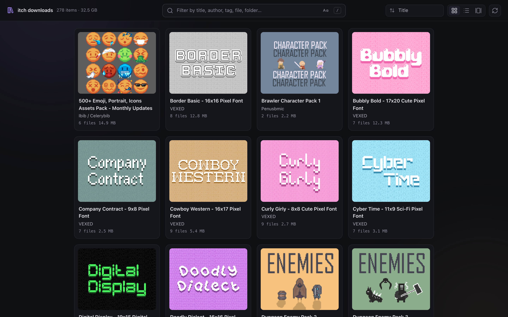

The list view (`2`) trades covers for a table: title and folder, author, tags, file count, size and last change. Click a column header to sort by it, again to flip the direction.

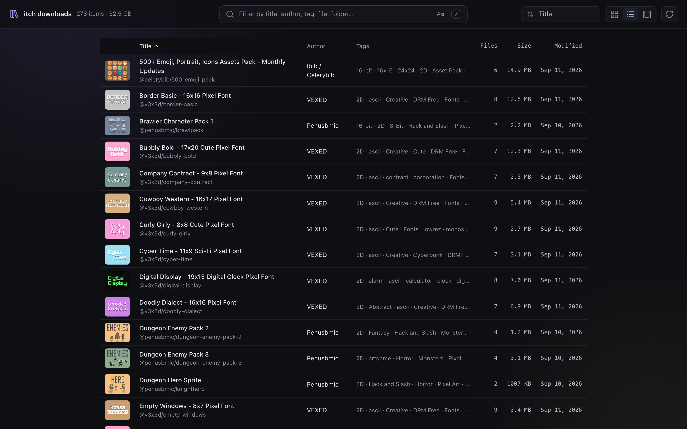

The gallery view (`3`) is Finder-style: one big cover with a filmstrip below it, `←`/`→` to move through the library.

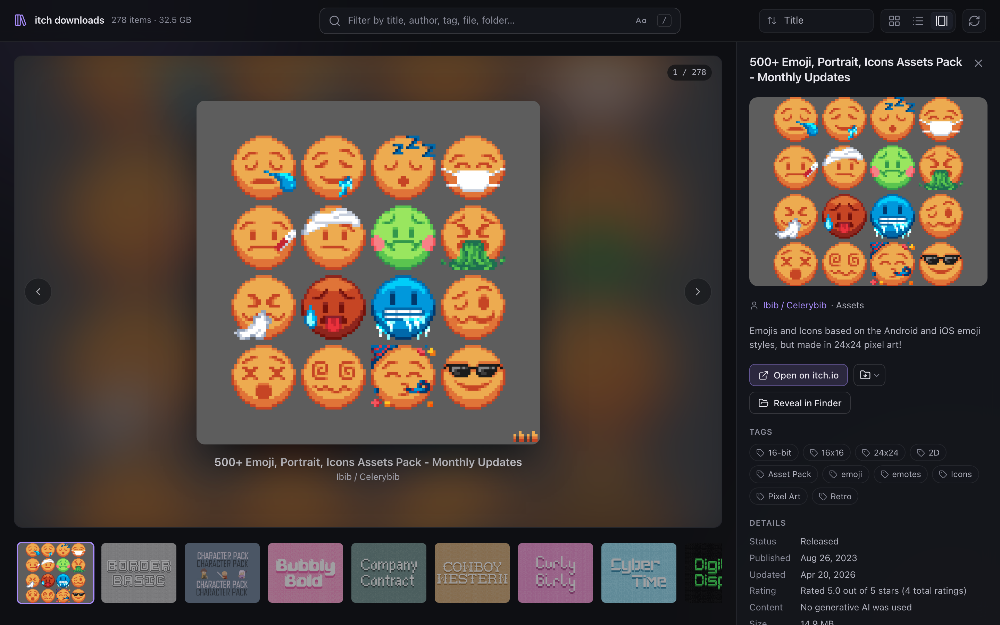

## Finding things

Press `/` (or `⌘K` / `Ctrl+K`) and type anything related to what you are after. Every word has to match somewhere in the item — title, author, tag, bundle, genre, file name or folder name — and the results narrow as you type. Here `dark icon` pulls up the DARK Series icon packs and everything else tagged with either word; the count in the top bar says how much of the library survived.

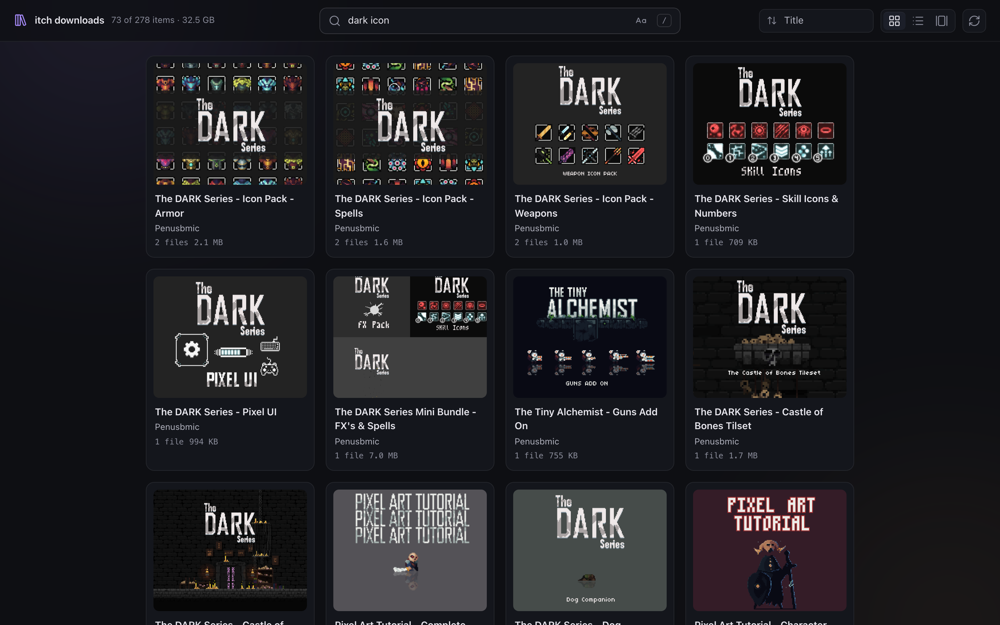

Tags and bundles in the inspector are clickable and drop themselves into the filter, so "everything from this bundle" or "everything tagged *Fonts*" is one click.

## The inspector

Clicking an item slides in its details: cover artwork, description, tags, the "More information" table itch.io shows on the product page (rating, licence, release date, engine…), the bundle it came from, page captures and the file list. *Open on itch.io* goes to the product page; *Reveal in Finder* opens the folder on disk (only offered when the page is opened on the machine running the server).

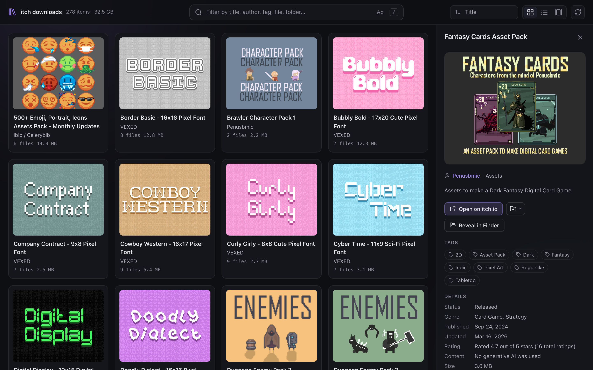

The folder icon next to *Open on itch.io* is the download button. When both ways to download are available it opens a small menu:

- **Download folder** zips the item's directory on the fly and streams it to you (`.incomplete`, hidden and system files such as `.DS_Store` or `Thumbs.db` are left out; the manifest goes in without its keys). There is no size cap — archives past 4 GB are written in Zip64.
- **Download from itch.io** runs the downloader for that one item, on the server, into a temporary directory, and hands the result over as a fresh zip. Progress shows in an overlay and can be cancelled. Your library on disk is not touched.

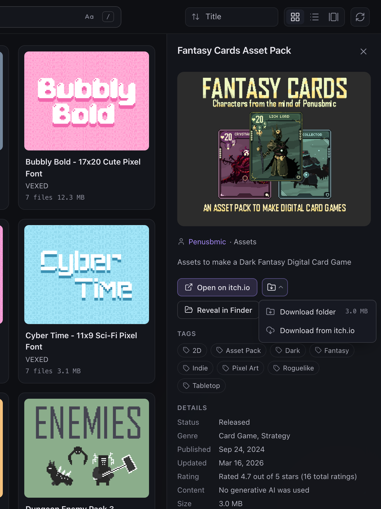

## Selecting several items

Shift+click an item — or press and hold it, on a phone — and a bar appears at the bottom of the screen: the selection has begun. From then on a plain click toggles an item in or out, `⌘A` / `Ctrl+A` takes everything the filter currently shows, and `Esc` (or the × on the bar) clears the selection and puts the browser back to normal. The bar counts the items and their total size and offers what can be done with all of them at once:

- **Copy details** puts a JSON array on the clipboard with the manifest of every selected item, in the form the server serves them (no download keys). An item without a manifest contributes what the library knows about it — title, author, tags, folder, files.
- **Download** follows the same rules as the download button of a single item: when every selected item can be fetched from itch.io again it opens the menu of *Download folders* / *Download from itch.io*, otherwise it downloads the folders straight away. Either way you get one zip holding a folder for each item, and a small dialog asks what to call it — `2026-09-12--itch.io-downloads` unless you have a better idea. *Download from itch.io* fetches the items one after the other as a single job; if one of them fails the others still arrive, and the toast at the end says which did not.
- **Hide / unhide** (admins only, the eye button) hides every selected item; once everything in the selection is hidden the same button unhides it again.
- **Delete** (admins only) removes every selected folder from disk after one confirmation.

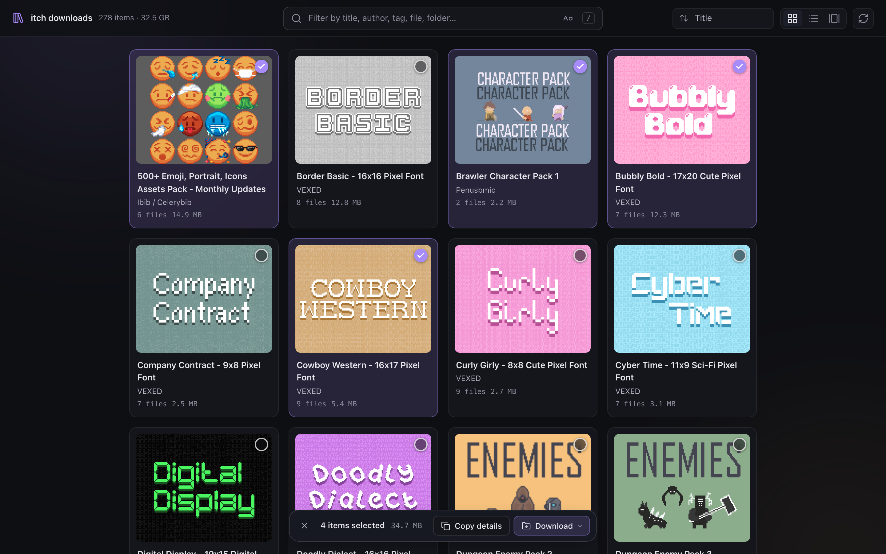

## Files

The Files section is a file browser. Folders expand in place at any depth, and any folder can be *flattened* — the button on its row, or the one in the section header for all of them — to list everything inside it at once, images first. That turns a sprite pack with a dozen sub-folders into one scrollable list of pictures. Every row has a download button, and next to it the reveal-in-Finder button.

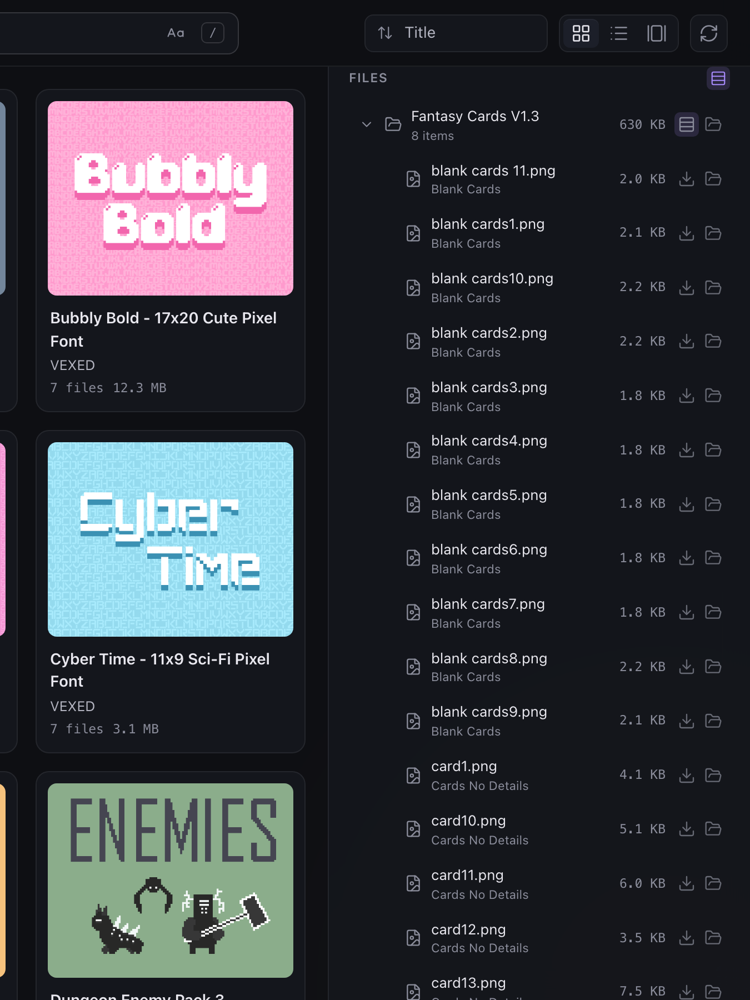

## The viewer

Clicking a file opens it full screen. Images sit on a checkerboard (switchable to white, black or a colour picked from the image) with integer zoom — *Fit / 1× / 2× / 4× / 8×* — and nearest-neighbour scaling by default so pixel art stays crisp; a toggle switches to smooth scaling for photos. JSON is highlighted, markdown and text are rendered, PDFs, video and audio play inline, and anything else (archives, `.aseprite` files…) gets a card with a download button.

`←`/`→`, the arrows or a swipe move through the files in the order the file list shows them; the strip at the bottom jumps anywhere; `Esc` closes.

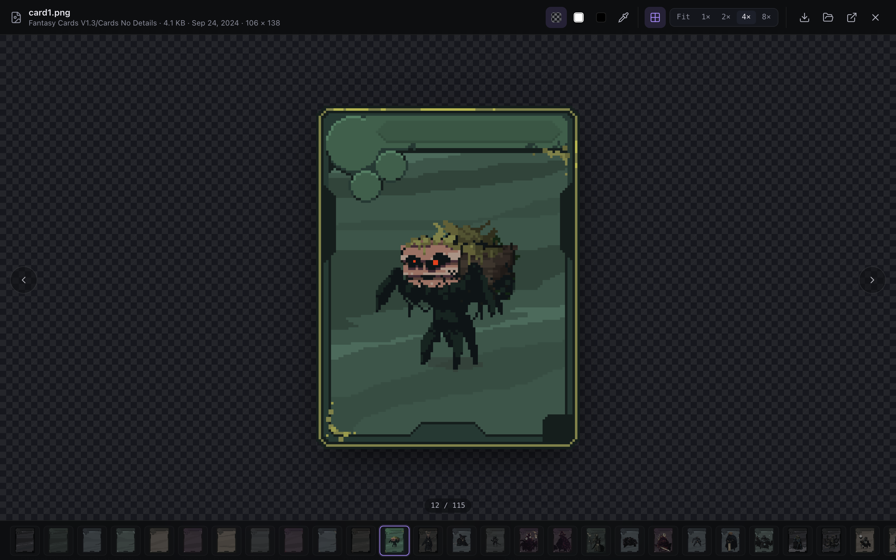

## Admin

With `admin_password` set in `appconfig.toml`, the library icon in the top bar offers *Admin sign-in*. Signed in, the inspector grows a few things:

- **Hide item** takes an item out of the library for everyone else — files, zip and "Download from itch.io" stop being served for it. The eye button that appears next to refresh shows hidden items again (marked *hidden*), and the top bar counts them.
- **Unzip** — the icon of every `.zip` in the file list turns into an open-package button on hover; *Unzip all* at the top of the panel extracts every archive at the item's top level. Extraction follows Archive Utility's rules and never overwrites anything.
- **Delete item** at the bottom, in red, removes the folder from disk after a confirmation. The selection bar's *Delete* does the same for several items at once, and its eye button hides or unhides the whole selection.

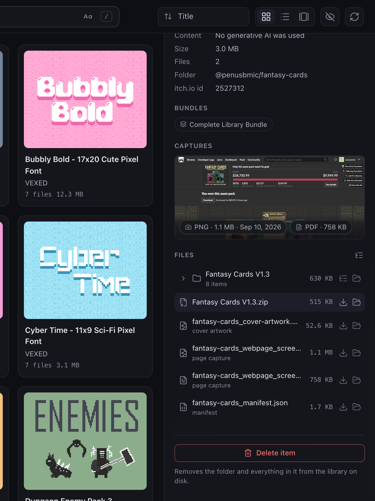

## On a phone

Everything above works on a phone. Start the server with `--host` (bare, it listens on every interface; the startup log prints the addresses other devices can use), open the address on the phone, and the grid reflows to two columns; the inspector becomes a full-screen sheet and, in the gallery view, hides behind a *Details* button.

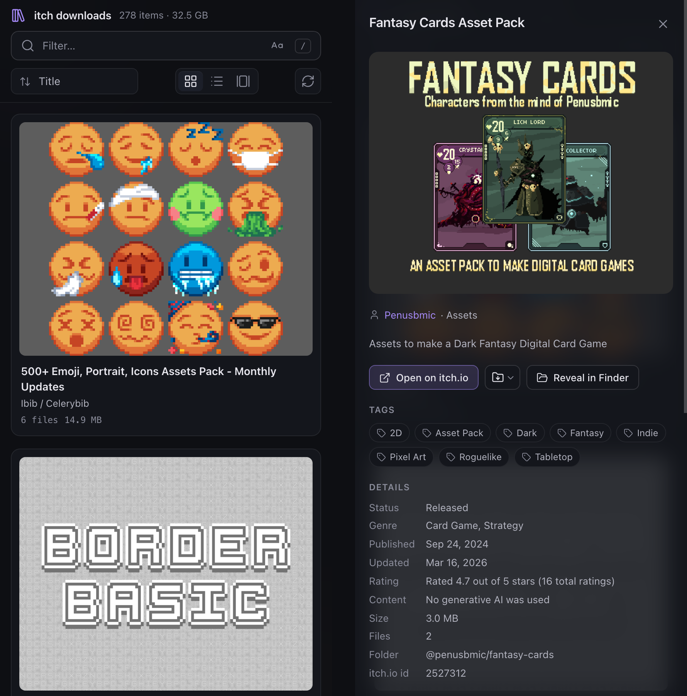

Anyone who can reach the port can browse and download the library — the keys never leave the server, but everything else is available — so keep it to networks you trust.

## Keyboard

| Key | Does |
| --- | --- |
| `/`, `⌘K`, `Ctrl+K` | Focus the filter |
| `1` `2` `3` | Grid, list, gallery view |
| `←` `→` | Previous / next item (gallery), previous / next file (viewer) |
| `Shift`+click, press and hold | Start selecting items |
| `⌘A`, `Ctrl+A` | Select every item the filter shows |
| `Esc` | Clear the selection; close the viewer or the inspector; in the filter box, clear it |
